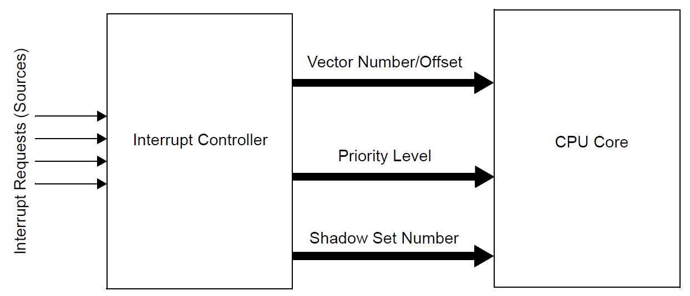

# 📑 Table of Contents

- [📑 Table of Contents](#-table-of-contents)
- [📘 Introduction to Interrupt Controller on PIC32MX Microcontroller](#-introduction-to-interrupt-controller-on-pic32mx-microcontroller)
- [✨ Features of the Driver](#-features-of-the-driver)
- [📖 API Documentation and Usage](#-api-documentation-and-usage)
  - [Driver Functions](#driver-functions)
    - [`IC_EnableInterrupts()`](#ic_enableinterrupts)
    - [`IC_DisableInterrupts()`](#ic_disableinterrupts)
    - [`IC_SetInterruptState()`](#ic_setinterruptstate)
    - [`IC_GetInterruptState()`](#ic_getinterruptstate)
- [🚀 Future Development](#-future-development)
- [](#)

# 📘 Introduction to Interrupt Controller on PIC32MX Microcontroller

The PIC32 device generates interrupt requests in response to interrupt events from peripheral modules. The Interrupt Controller module exists external to the CPU logic and prioritizes the interrupt events before presenting them to the CPU.

<div align="center">

<a id="fig1"></a>


**Figure 1**: PIC32 General Interrupt Controller Block Diagram.<br>
<small>Source: Microchip PIC32 Documentation</small>

</div>

The Interrupt Controller is responsible for preprocessing an Interrupt Request (IRQ) from a number of on-chip peripherals and presenting them in the appropriate order to the processor. The Interrupt Controller is designed to receive up to 256 IRQs from the processor core, on-chip peripherals capable of generating interrupts, and five external inputs.

The user can assign a group priority to each of the interrupt vectors. If an interrupt priority is set to zero, the interrupt vector is disabled for both interrupt and wake-up purposes. Interrupt vectors with a higher priority level preempt lower priority interrupts.

# ✨ Features of the Driver

The driver provides only wrappers for actual functions that tackle with low-level registers of MCU.

# 📖 API Documentation and Usage

## Driver Functions

### `IC_EnableInterrupts()`
```cpp
INLINE void IC_EnableInterrupts(void);
```
This function enables interrupts (all sources can be triggered).


### `IC_DisableInterrupts()`
```cpp
INLINE void IC_DisableInterrupts(void);
```
This function disables interrupts (neither of sources can be triggered).

### `IC_SetInterruptState()`
```cpp
INLINE void IC_SetInterruptState(volatile uint32_t intrState);
```
This function restores interrupt state (use with `IC_GetInterruptState()`).

### `IC_GetInterruptState()`
```cpp
INLINE volatile uint32_t IC_GetInterruptState(void);
```
This function reads state of interrupts (enabled or disabled).

# 🚀 Future Development

Looking ahead, here are some ideas for the continued development of the SPI driver:
- Add functions for disabling/enabling/restoring state of individual interrupt sources.

# 

&copy; Luka Gacnik, 2023