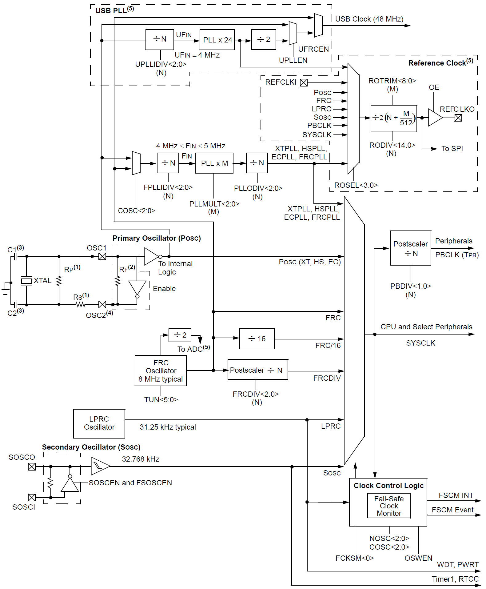
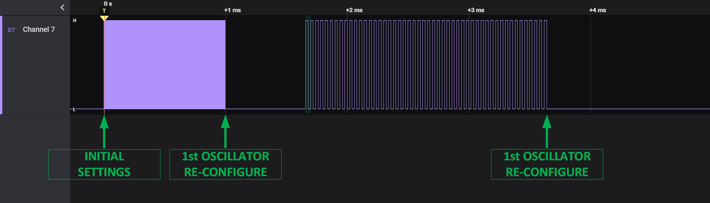
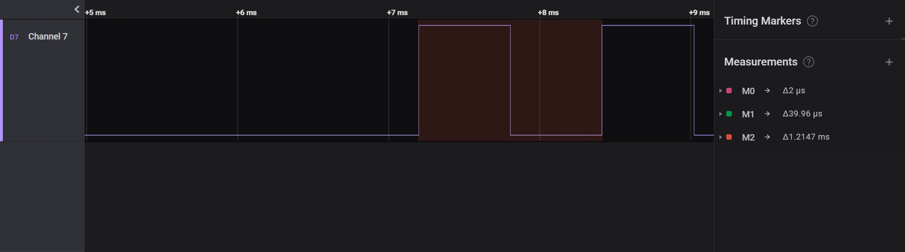

# 📑 Table of Contents

- [Table of Contents](#-table-of-contents)
- [Introduction to Oscillator on PIC32MX Microcontroller](#-introduction-to-oscillator-on-pic32mx-microcontroller)
- [Features of the Driver](#-features-of-the-driver)
- [API Documentation and Usage](#-api-documentation-and-usage)
  - [Macro Definitions](#macro-definitions)
  - [Data Types and Structures](#data-types-and-structures)
  - [Driver Functions](#driver-functions)
- [Hands-on Examples](#️-hands-on-examples)
- [Example: Oscillator Clock Switch](#example-oscillator-clock-switch)

# 📘 Introduction to Oscillator on PIC32MX Microcontroller

An oscillator module generates clock signal which is required for a device to execute instructions and for the peripherals to function. Such a module may consist of a set of registers that control various clocking settings such as oscillator source selection, clock frequency division factors, PLL multiplier, clock source switching, fine frequency tuning, and more.

<div align="center">

<a id="fig1"></a>


**Figure 1**: PIC32 General Oscillator Block Diagram.<br>
<small>Source: Microchip PIC32 Documentation</small>

</div>

One of the more important features of the Oscillator module in PIC32 MCUs is the flexibility of clock source selection and its configuration. And since it is possible to select between multiple clock sources another important feature is a clock switch routine which allows use to switch to an alternative clock source at runtime (e.g. transitioning to sleep mode by means of switching to Low Power Oscillator).

# ✨ Features of the Driver

The Oscillator driver currently supports:
- Configuring system (and peripheral) clock frequency with source selection option
- Reading system (or peripheral) clock frequency currently configured

# 📖 API Documentation and Usage

This section offers a brief introduction to the Oscillator API. For comprehensive details, please refer to the [PIC32MX_Oscillator_API_doc](PIC32MX_Oscillator_API_doc.pdf). It's important to note that the `Osc.c` source file is thoroughly annotated with quality comment blocks for your convenience.

## Macro Definitions

The API employs preprocessor macros to facilitate a certain level of clock frequency configuration:
- `OSC_XTAL_FREQ` defines the frequency of external oscillator and should be set by the user in case of using any of external oscillators.
- `OSC_FRC_FREQ`, `OSC_LPRC_FREQ`, `OSC_SOSC_FREQ`, and `OSC_SYSCLK_MAX` macro defines are fixed and device-specific. Change them to appropriate value in case of migrating to other PIC32 family with different Oscillator module specifications.

## Data Types and Structures

Note that only `struct` types are outlined here. Other, `enum` types are assumed to be self-explanatory to the reader.

### `OscConfig_t`

This configuration structure provides configuration parameters when trying to set-up a clock source using the `OSC_ConfigOsc()` function.

## Driver Functions

### `OSC_ConfigOsc()`
```cpp
bool OSC_ConfigOsc(OscConfig_t oscConfig);
```
This function configures the oscillator registers to generate a system and peripheral frequency from
the selected oscillator source.

### `OSC_GetSysFreq()`
```cpp
uint32_t OSC_GetSysFreq(void);
```
This function reads the value of the system clock frequency.

### `OSC_GetPbFreq()`
```cpp
uint32_t OSC_GetPbFreq(void);
```
This function reads the value of the peripheral clock frequency.

### `OSC_GetClkSource()`
```cpp
INLINE OscClkSource_t OSC_GetClkSource(void);
```
This function reads the value of the oscillator module source selection.

# 🖥️ Hands-on Examples

This section showcases how to utilize the API covered in the previous section, providing practical examples. The examples are briefly summarized for demonstration purposes. For comprehensive details, please refer to the [PIC32MX_Oscillator_API_doc](PIC32MX_Oscillator_API_doc.pdf) documentation. The complete code of the example outlined below can be found in the [examples](examples) folder.

# Example: Oscillator Clock Switch

Below is an example demonstrating how to perform clock switch from the initially configured clock source (from Configuration Registers) to another clock source at runtime. Pin is toggled for demonstration purpose of indicating how clock frequency changes on an output pin which toggles at a rate of the currently employed system clock frequency.

```cpp
/** Custom libs **/
#include "Osc.h"
#include "Pio.h"

int main(int argc, char** argv)
{
	/* Oscillator initial configuration parameters */
	OscConfig_t oscConfig = {
		.oscSource = OSC_COSC_FRCPLL,
		.sysFreq = 20000000,
		.pbFreq = 20000000
	};

	uint32_t cntr, sysFreq1, sysFreq2, sysFreq3;

	/* Configure indicating pin */
	PIO_ClearPin(GPIO_RPB4);
	PIO_ConfigGpioPin(GPIO_RPB4, PIO_TYPE_DIGITAL, PIO_DIR_OUTPUT);

	/* Initial oscillator configuration */
	OSC_ConfigOsc(oscConfig);
	sysFreq1 = OSC_GetSysFreq();

	/* Toggle pin */
	cntr = 1000;
	while (cntr--)
	{
		PIO_TogglePin(GPIO_RPB4);
	}

	PIO_ClearPin(GPIO_RPB4);

	/* Re-configure oscillator first time */
	oscConfig.sysFreq = 1000000;
	OSC_ConfigOsc(oscConfig);
	sysFreq2 = OSC_GetSysFreq();

	/* Toggle pin */
	cntr = 100;
	while (cntr--)
	{
		PIO_TogglePin(GPIO_RPB4);
	}

	/* Re-configure oscillator second time */
	oscConfig.oscSource = OSC_COSC_LPRC;
	OSC_ConfigOsc(oscConfig);
	sysFreq3 = OSC_GetSysFreq();

	/* Toggle pin */
	cntr = 10;
	while (cntr--)
	{
		PIO_TogglePin(GPIO_RPB4);
	}

	while (1) {}

	return 0;
}
```

Transition from one clock source to another can be seen in the measurement below which was taken using the [Logic8] logic analyzer.

<div align="center">

<a id="fig2"></a>


**Figure 2**: Clock Switch Transition Part 1.<br>

</div>

*Note: The 3rd green block annotating the start of 2nd oscillator source reconfigure and not the 1st one.*

<div align="center">

<a id="fig3"></a>


**Figure 3**: Clock Switch Transition Part 2.<br>

</div>

#

&copy; Luka Gacnik, 2023
