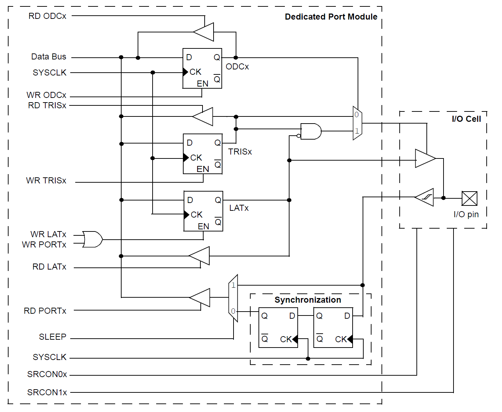
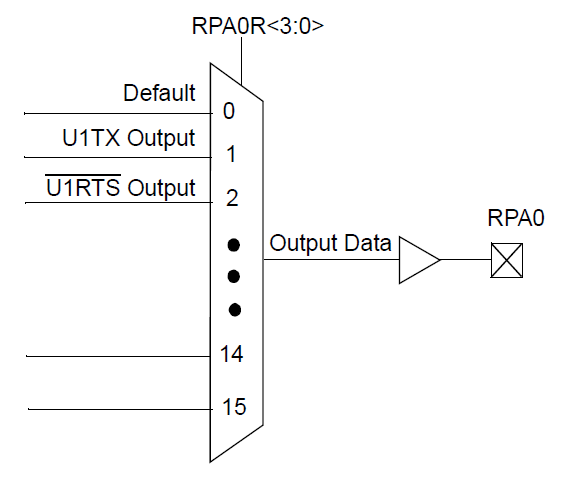

# 📑 Table of Contents

- [📑 Table of Contents](#-table-of-contents)
- [📘 Introduction to Programmable Inputs Outputs on PIC32MX Microcontroller](#-introduction-to-programmable-inputs-outputs-on-pic32mx-microcontroller)
- [📚 Dependencies](#-dependencies)
- [✨ Features of the Driver](#-features-of-the-driver)
- [📖 API Documentation and Usage](#-api-documentation-and-usage)
  - [Macro Definitions](#macro-definitions)
  - [Data Types and Structures](#data-types-and-structures)
  - [Driver Functions](#driver-functions)
- [🖥️ Hands-on Examples](#️-hands-on-examples)
  - [Example: Input Change](#example-input-change)

# 📘 Introduction to Programmable Inputs Outputs on PIC32MX Microcontroller

The general purpose I/O pins can be considered the simplest of peripherals. These I/O pins allow the PIC32 microcontroller to monitor and control other devices. To add flexibility and functionality to a device, some pins are multiplexed with alternate function(s), depending on which peripheral features are present on the device. Generally, when a peripheral is functioning, that pin may not be used as a general purpose I/O pin.

<div align="center">

<a id="fig1"></a>


**Figure 1**: PIC32 General SPI Block Diagram.<br>
<small>Source: Microchip PIC32 Documentation</small>

</div>

In addition to basic functions, PIC32MX devices come with Input Change Notification (CN) registers, which can generate interrupt requests in response to a change-of-state on input pins, and Peripheral Pin Select (PPS) registers that provide control bits for assigning pins to available peripheral modules.

<div align="center">

<a id="fig2"></a>


**Figure 2**: PIC32 PPS Output Pin Multiplexing .<br>
<small>Source: Microchip PIC32 Documentation</small>

</div>

# 📚 Dependencies

The PIO driver depends on the following libraries:
- `Cfg.h`: provides means of unlocking specific set of registers
- `Ic.h`: provides interrupt control functions for interrupt-based SPI operations.

# ✨ Features of the Driver

The PIO driver currently supports:
- Configuring a GPIO pin with selectable options for data pin direction, pin type, driver type, and pull type.
- Configuring a peripheral pin via PPS registers.
- Configuring CN registers for external event-triggered ISR.
- Reading the input pin state and generating an output pin state.

# 📖 API Documentation and Usage

This section offers a brief introduction to the PIO API. For comprehensive details, please refer to the [PIC32MX_PIO_API_doc](PIC32MX_PIO_API_doc.pdf). It's important to note that the `Pio.c` and `Pio.h` files are thoroughly annotated with quality comment blocks for your convenience.

## Macro Definitions

The API employs preprocessor macros to facilitate a certain level of configuration for interrupt-based operation settings. The defines `CN_ISR_IPL`, `CN_ICX_IPL`, and `CN_ICX_ISL` set the *Change Notice* (aka. Input Change) interrupt priority and sub-priority levels.

## Data Types and Structures

Note that only `struct` types are outlined here. Other, `enum` types are assumed to be self-explanatory to the reader.

### `PinInfo_t`

This structure provides pin information upon user's request. Note that using this PIO driver pin information is conveyed two ways: using `PinInfo_t` type object or using a 32-bit wide macro code defined in the `Pio_sfr.h`. Extensive documentation on 32-bit pin codes and their meaning is provided in the [PIC32MX_PIO_API_doc](PIC32MX_PIO_API_doc.pdf) documentation.

## Driver Functions

### `PIO_ConfigPpsSfr()`
```cpp
bool PIO_ConfigPpsSfr(const uint32_t pinCode);
```
This function configures a pin, specified by a pin code, as a peripheral-controlled pin.

### `PIO_ReleasePpsSfr()`
```cpp
bool PIO_ReleasePpsSfr(const uint32_t pinCode);
```
This function releases PPS control over an output peripheral-controlled pin.

### `PIO_ConfigInputChange()`
```cpp
bool PIO_ConfigInputChange(const uint32_t pinCode, PioPullType_t pullType);
```
This function configures Change Notice (CN) SFRs for the corresponding pin.

### `PIO_SetIsrHandler()`
```cpp
bool PIO_SetIsrHandler(const uint32_t pinCode, volatile void (*isrHandler)(void));
```
This function configures Change Notice (CN) SFRs for the corresponding pin.

### `PIO_ConfigPpsPin()`
```cpp
INLINE void PIO_ConfigPpsPin(const uint32_t pinCode, PioPinType_t pinType);
```
This function configures a peripheral-controlled pin as either analog or digital pin.

### `PIO_ConfigGpioPin()`
```cpp
INLINE void PIO_ConfigGpioPin(const uint32_t pinCode, PioPinType_t pinType, PioPinDirect_t pinDir);
```
This function configures a GPIO pin with a selected type and data direction.

### `PIO_ConfigGpioPinDir()`
```cpp
INLINE void PIO_ConfigGpioPinDir(const uint32_t pinCode, PioPinDirect_t pinDir);
```
This function configures a GPIO pin with a selected data direction.

### `PIO_ConfigGpioPinType()`
```cpp
INLINE void PIO_ConfigGpioPinType(const uint32_t pinCode, PioPinType_t pinType);
```
This function configures a GPIO pin with a selected type.

### `PIO_ConfigGpioPinPull()`
```cpp
INLINE void PIO_ConfigGpioPinPull(const uint32_t pinCode, PioPullType_t pullType);
```
This function configures a GPIO input pin with an internal pull resistor.

### `PIO_ConfigPinDriver()`
```cpp
INLINE void PIO_ConfigPinDriver(const uint32_t pinCode, PioPinDriver_t pinDriver);
```
This function configures a GPIO or peripheral-controlled pin’s type of driver.

### `PIO_ReadPinCode()`
```cpp
INLINE PinInfo_t PIO_ReadPinCode(const uint32_t pinCode);
```
This function returns information about pin module, data direction, and position. 

### `PIO_ReadPinModule()`
```cpp
INLINE PioSfr_t *const PIO_ReadPinModule(const uint32_t pinCode);
```
This function returns PIO module base address of a given pin code.

### `PIO_ReadPinDirection()`
```cpp
INLINE PioPinDirect_t PIO_ReadPinDirection(const uint32_t pinCode);
```
This function returns data direction of a given pin code.

### `PIO_ReadPinPosition()`
```cpp
INLINE PioPinPos_t PIO_ReadPinPosition(const uint32_t pinCode);
```
This function returns pin position of a given pin code.

### `PIO_ClearPin()`
```cpp
INLINE void PIO_ClearPin(const uint32_t pinCode);
```
This function clears output pin state for a given pin code.

### `PIO_SetPin()`
```cpp
INLINE void PIO_SetPin(const uint32_t pinCode);
```
This function sets output pin state for a given pin code.

### `PIO_TogglePin()`
```cpp
INLINE void PIO_TogglePin(const uint32_t pinCode);
```
This function toggles output pin state for a given pin code.

### `PIO_ReadPin()`
```cpp
INLINE uint32_t PIO_ReadPin(const uint32_t pinCode);
```
This function reads input pin state for a given pin code.

# 🖥️ Hands-on Examples

This section showcases how to utilize the API covered in the previous section, providing practical examples. The examples are briefly summarized for demonstration purposes. For comprehensive details, please refer to the [PIC32MX_PIO_API_doc](PIC32MX_PIO_API_doc.pdf) documentation. The complete code of the examples outlined below can be found in the [examples](examples) folder.

## Example: Input Change

A simple example which demonstrates usage of some of the provided API. *Change Notice* is a capability of PIO which enables it to respond to outside events (e.g. reading a button state) through an ISR handler and respond immediately without the need for polling for the input state.

```cpp
/** Custom libs **/
#include "Pio.h"

/** Test variable **/
static volatile uint32_t inputChangeCounter = 0;

/** Test prototype **/
static void TestFunct(void);

int main(int argc, char** argv)
{
	/* Configure signal generator */
	PIO_ConfigGpioPin(GPIO_RPA2, PIO_TYPE_DIGITAL, PIO_DIR_OUTPUT);

	/* Set idle state of input signal */
	PIO_ClearPin(GPIO_RPA2);

	/* Configure input change feature of PIO module */
	PIO_ConfigInputChange(GPIO_RPB4, PIO_CN_NONE);

	/* Configure a function pointer */
	PIO_SetIsrHandler(GPIO_RPB4, TestFunct);

	/* Simulate input signal */
	PIO_SetPin(GPIO_RPA2);
	PIO_ClearPin(GPIO_RPA2);
	PIO_SetPin(GPIO_RPA2);
	PIO_ClearPin(GPIO_RPA2);

	while (1)
	{
		/* 'TestFunct()' is executed from ISR each time a change
                   in input at pin RPA2 is detected */
	}

	return 0;
}

/** Test function **/
static void TestFunct(void)
{
	inputChangeCounter++;
}
```

#

&copy; Luka Gacnik, 2023
