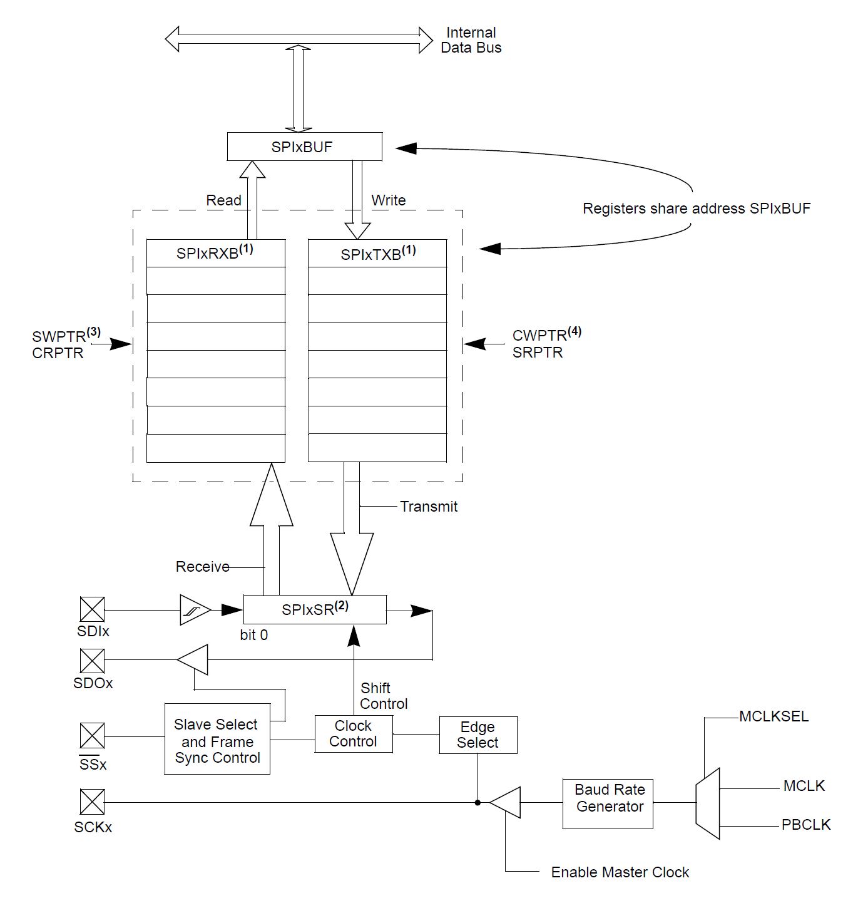
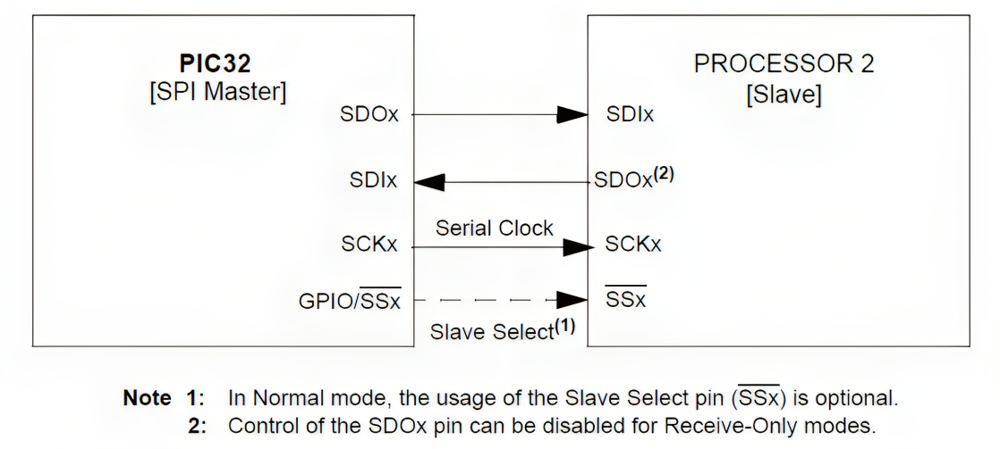
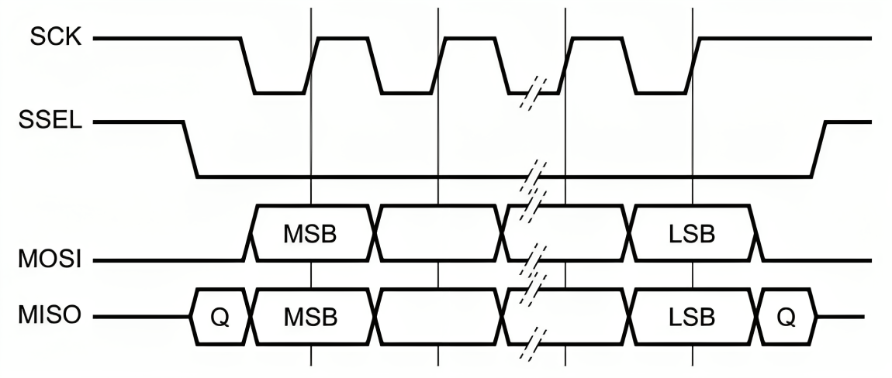
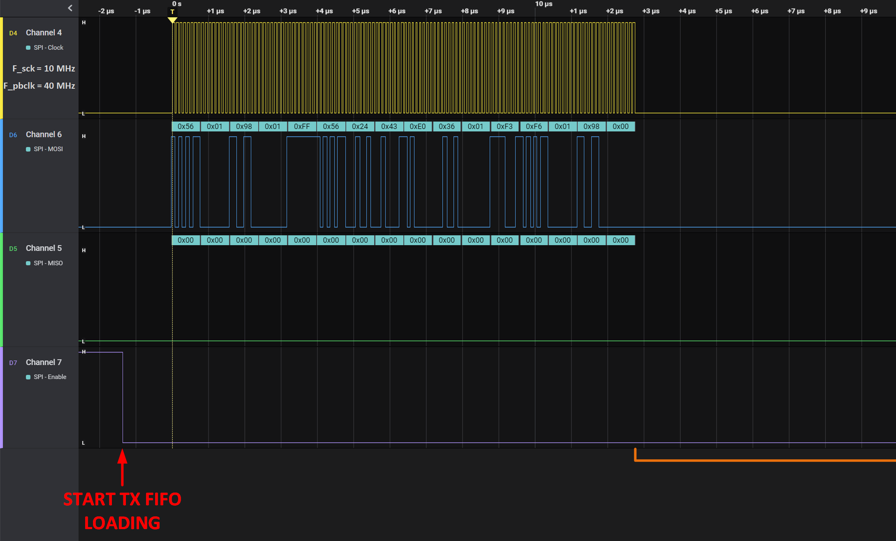
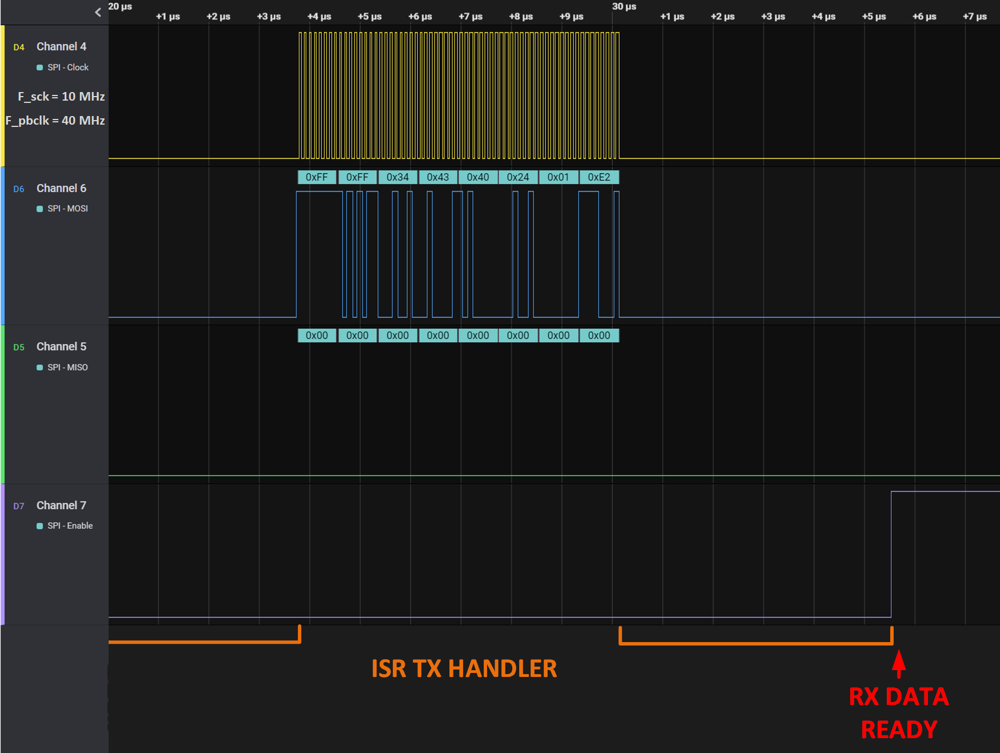
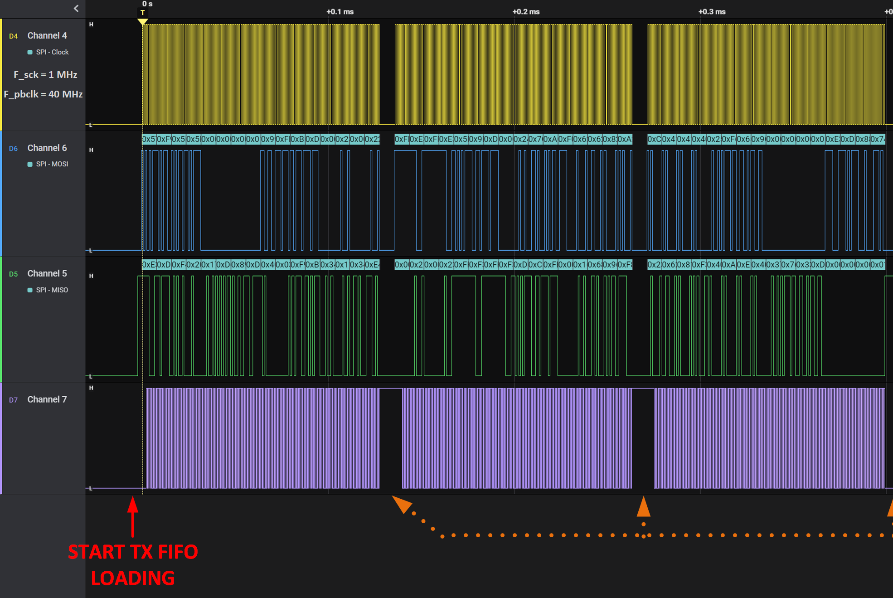
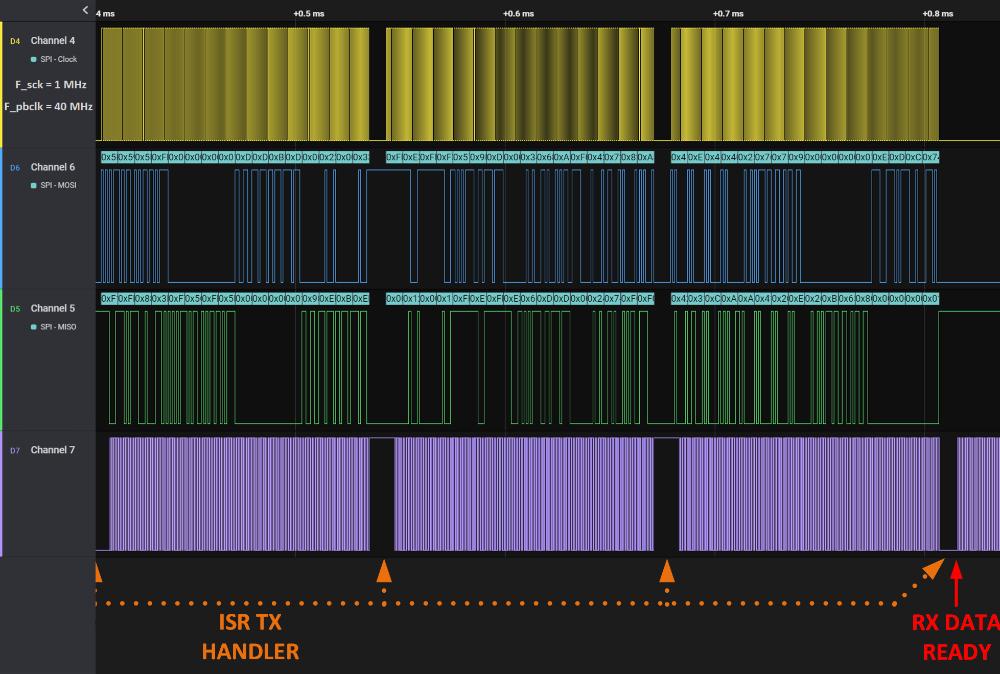

# 📑 Table of Contents

- [📑 Table of Contents](#-table-of-contents)
- [📘 Introduction to Serial Peripheral Protocol on PIC32MX Microcontroller](#-introduction-to-serial-peripheral-protocol-on-pic32mx-microcontroller)
- [📚 Dependencies](#-dependencies)
- [✨ Features of the Driver](#-features-of-the-driver)
- [📖 API Documentation and Usage](#-api-documentation-and-usage)
	- [Macro Definitions](#macro-definitions)
	- [Data Types and Structures](#data-types-and-structures)
	- [Driver Functions](#driver-functions)
- [🖥️ Hands-on Examples](#️-hands-on-examples)
	- [Example 1: Multi-packet 8-bit Master transmission](#example-1-multi-packet-8-bit-master-transmission)
	- [Example 2: Multi-packet 32-bit Slave reception](#example-2-multi-packet-32-bit-slave-reception)
- [⏱️ Measurements and Performance](#️-measurements-and-performance)
	- [Test 1: Master Mode Polling Operation](#test-1-master-mode-polling-operation)
	- [Test 2: Master-Slave Interrupt Operation](#test-2-master-slave-interrupt-operation)
- [🚀 Future Development](#-future-development)

# 📘 Introduction to Serial Peripheral Protocol on PIC32MX Microcontroller

The Serial Peripheral Interface (SPI) module is a synchronous serial interface useful for communicating with external peripherals and other microcontroller devices. These peripheral devices may include a serial EEPROM, shift register, display driver, Analog-to-Digital Converter (ADC), or an audio codec.

<div align="center">

<a id="fig1"></a>


**Figure 1**: PIC32 General SPI Block Diagram.<br>
<small>Source: Microchip PIC32 Documentation</small>

</div>

The SPIx serial interface consists of four pins:
- `SDIx`: Serial Data Input
- `SDOx`: Serial Data Output
- `SCKx`: Shift Clock Input or Output
- `SSx`: Active-Low Slave Select or Frame Synchronization I/O Pulse

<div align="center">

<a id="fig2"></a>


**Figure 2**: PIC32 SPI Normal Operation Connections.<br>
<small>Source: Microchip PIC32 Documentation</small>

</div>

A typical SPI communication protocol timing diagram is outlined below. If both data pins `MOSI` (also known as the Master device `SDO` pin) and `MISO` (also known as the Master device `SDI` pin) are present, then the communication is said to be *Full-Duplex*. If either one or the other pin is used, then we are referring to *Half-Duplex* communication. Pin SS is optional in the* Single Master - Single Slave* topology, while it is usually required in the case of the *Single Master - Multi Slave* topology and dictates which of the available devices will listen to data traffic on the SPI bus.

<div align="center">

<a id="fig3"></a>


**Figure 3**: SPI Timing Diagram.<br>
<small>Source: https://community.nxp.com/t5/NFC/SPI-Timing-question-ADS7052-with-NHS3152/td-p/1271793</small>

</div>

# 📚 Dependencies

The SPI driver depends on the following libraries:
- `Pio.h`: provides control over the Peripheral Pin Select module, which handles SPI pin remapping, and the Programmable Inputs Outputs module, which configures them.
- `Osc.h`: provides means of baud rate configuration.
- `Ic.h`: provides interrupt control functions for interrupt-based SPI operations.

# ✨ Features of the Driver

The SPI driver currently supports:
- Configuring the selected SPI module for standard (non-audio mode) SPI Master operation.
- Performing polling-based SPI write and read operations, which offer the fastest execution.
- Performing interrupt-based SPI write or read operations, which result in the highest program execution efficiency.
- Performing interrupt-based special SPI write or read operations, where a user-defined function is executed at the end of an SPI operation.

# 📖 API Documentation and Usage

This section offers a brief introduction to the SPI API. For comprehensive details, please refer to the [PIC32MX_SPI_API_doc](PIC32MX_SPI_API_doc.pdf). It's important to note that the `Spi.c` source file is thoroughly annotated with quality comment blocks for your convenience.

## Macro Definitions

The API employs preprocessor macros to facilitate a certain level of configuration for interrupt-based operation settings. However, if your preference leans towards polling-based operations, feel free to disregard these macros. The defines `SPIx_ISR_IPL`, `SPIx_ICX_IPL`, and `SPIx_ICX_ISL` (where `x` ranges from 0 to 1) set the SPI interrupt priority and sub-priority levels.

## Data Types and Structures

Note that only `struct` types are outlined here. Other, `enum` types are assumed to be self-explanatory to the reader.

### `SpiStandardConfig_t`

This configuration structure provides SPI operation parameters and is used for SPI configuration before any operation is executed. It is intended to be used only with the `SPI_ConfigStandardModeSfr()` function.

### `SpiPin_t`

This configuration structure provides a selection of SPI pins used for SPI communication. Please refer to the `Pio_sfr.h` header file provided as part of the [PIO](../Pio/Pio_sfr.h) library when configuring pins using the given pin codes. The codes are given as 32-bit wide codes that provide information about the pin's PIO and PPS (Peripheral Pin Select) settings. The SPI pins of interest appear in the following format: `SDOx_RPyz`, `SDIx_RPyz`, and `SSx_RPyz`, where `x` marks the module number, `y` marks the port of the pin location, and `z` marks the pin number (e.g., `SS1_RPA0`). Please refer to the [PIC32MX_PIO_API_doc](../Pio/PIC32MX_PIO_API_doc.pdf) for more information about pin codes and their purpose.

### `SpiSsState_t`

This structure provides information about which SPI Slave Select pins will be controlled during SPI operation. Depending on which port is used for the Slave Select pin, if any, one should select the appropriate attribute of this type. Input is given as a bit mask of the pin(s) that need to be triggered during SPI operation.

## Driver Functions

### `SPI_ConfigStandardModeSfr()`
```cpp
bool SPI_ConfigStandardModeSfr(SpiSfr_t *const spiSfr, SpiStandardConfig_t spiConfig);
```
This function configures SPI pins and SPI-related SFRs for standard (non-audio) operation.

### `SPI_EnableSsState()`
```cpp
bool SPI_EnableSsState(const uint32_t pinCode);
```
This function enables GPIO Slave Select pins, which will be controlled during any SPI operation. This function does not manually enable the Slave device; this is done internally.

### `SPI_DisableSsState()`
```cpp
bool SPI_DisableSsState(const uint32_t pinCode);
```
This function disables a GPIO Slave Select pin, effectively making the SPI driver ignore this pin during any SPI operation.

### `SPI_GetSsState()`
```cpp
SpiSsState_t SPI_GetSsState(void);
```
This function returns the Slave devices that are currently set to be triggered during any SPI operation.

### `SPI_SetSsState()`
```cpp
void SPI_SetSsState(const SpiSsState_t state);
```
This function has the same effect as the `SPI_EnableSsState()` or `SPI_DisableSsState()` functions, where any number of active Slave Select pins may be modified through the `SpiSsState_t` type of structure.

### `SPI_IsSpiBusy()`
```cpp
bool SPI_IsSpiBusy(SpiSfr_t *const spiSfr);
```
This function checks whether any SPI operation is in progress at the moment of the function call.

### `SPI_IsRxDone()`
```cpp
bool SPI_IsRxDone(SpiSfr_t *const spiSfr, uint8_t rxbufSize);
```
This function checks if the size of the RX FIFO buffer is equal to or larger than the value of `rxbufSize`.

### `SPI_MasterReadWrite()`
```cpp
bool SPI_MasterReadWrite(SpiSfr_t *const spiSfr, volatile void *rxPtr, volatile void *txPtr, uint32_t txSize);
```
This function executes a polling-based SPI TX data write and RX data read.

### `SPI_MasterWrite()`
```cpp
bool SPI_MasterWrite(SpiSfr_t *const spiSfr, volatile void *rxPtr, volatile void *txPtr, uint32_t txSize);
```
This function executes an interrupt-based SPI TX data write.

### `SPI_MasterWrite2()`
```cpp
bool SPI_MasterWrite2(SpiSfr_t *const spiSfr, volatile void *rxPtr, volatile void *txPtr, uint32_t txSize, volatile void (*isrHandler)(void));
```
This function operates the same way as `SPI_MasterWrite()`, except that a user-defined callback is executed from ISR immediately after the SPI write operation completes.

### `SPI_DummyRead()`
```cpp
bool SPI_DummyRead(SpiSfr_t *const spiSfr);
```
This function empties the RX FIFO buffer of an SPI module.

### `SPI_SlaveWrite()`
```cpp
bool SPI_SlaveWrite(SpiSfr_t *const spiSfr, volatile void *txPtr, uint32_t txSize);
```
This function loads the TX FIFO buffer with data when the SPI module operates in Slave mode.

### `SPI_SlaveRead()`
```cpp
bool SPI_SlaveRead(SpiSfr_t *const spiSfr, volatile void *rxPtr);
```
This function reads data from the RX FIFO buffer when the SPI module operates in Slave mode

# 🖥️ Hands-on Examples

This section showcases how to utilize the API covered in the previous section, providing practical examples. The examples are briefly summarized for demonstration purposes. For comprehensive details, please refer to the [PIC32MX_SPI_API_doc](PIC32MX_SPI_API_doc.pdf) documentation. The complete code of the examples outlined below can be found in the [examples](examples) folder.

## Example 1: Multi-packet 8-bit Master transmission

Below is an example demonstrating how to configure one SPI module in Master mode to send 8-bit packets to a Slave device, while another SPI module operates in Slave mode. This setup allows for testing SPI communication on the same chip without the need for external devices. Initially, both modules are configured to match the desired parameters. The Slave module is first loaded with data, and only then does the Master module start the SPI operation.

```cpp
/** Custom libs **/
#include "Spi.h"

int main(int argc, char** argv)
{
	/* Slave device SPI settings */
	SpiStandardConfig_t spiSlaveConfig = {
		.pinSelect = {
			.sdiPin = SDI1_RPB8,
			.sdoPin = SDO1_RPB11,
			.ss1Pin = SS1_RPB7
		},
		.isMasterEnabled = false,
		.frameWidth = SPI_WIDTH_8BIT,
		.clkMode = SPI_CLK_MODE_0
	};

	/* Master device SPI settings */
	SpiStandardConfig_t spiMasterConfig = {
		.pinSelect = {
			.sdiPin = SDI2_RPB13,
			.sdoPin = SDO2_RPB2,
			.ss1Pin = GPIO_RPB10
		},
		.isMasterEnabled = true,
		.frameWidth = SPI_WIDTH_8BIT,
		.clkMode = SPI_CLK_MODE_0,
		.sckFreq = 10000000
	};

	/* SPI module base address set */
	SpiSfr_t *spiSlaveSfr = &SPI1_MODULE;
	SpiSfr_t *spiMasterSfr = &SPI2_MODULE;

	/* Configure both SPI modules */
	SPI_ConfigStandardModeSfr(spiSlaveSfr, spiSlaveConfig);
	SPI_ConfigStandardModeSfr(spiMasterSfr, spiMasterConfig);

	/* Test data variables */
	uint32_t masterRxData[24] = {0};
	uint32_t masterTxData[24] = {0xABACADAF, 0x00000000, 0xCCEEDDEE,
                                     0x00110011, 0xFFF1FFF1, 0xABCDEF00,
                                     0x12345678, 0x21314151, 0xA0A0A0A0,
                                     0x12BB32CC, 0x00000000, 0xF1EBC43A,
                                     0xABACADAF, 0x00000000, 0xCCEEDDEE,
                                     0x00110011, 0xFFF1FFF1, 0xABCDEF00,
                                     0x12345678, 0x21314151, 0xA0A0A0A0,
                                     0x12BB32CC, 0x00000000, 0xF1EBC43A};
	uint32_t slaveTxData[24] =  {0xF1DE5210, 0x12AB49CF, 0xA0015CD7,
                                     0x12093472};

	/* Load Slave with data */
	SPI_SlaveWrite(spiSlaveSfr, slaveTxData, 4);

	/* Configure which Slave will be addressed */
	SPI_EnableSsState(spiMasterConfig.pinSelect.ss1Pin);

	/* Interrupt-based SPI write */
	SPI_MasterWrite(spiMasterSfr, masterRxData, masterTxData, 24);

	while (1)
	{
		/* Main program execution */
		
		if (SPI_IsSpiBusy(spiMasterSfr))
		{
			/* RX data ready, process data... */
		}
	}

	return 0;
}
```

## Example 2: Multi-packet 32-bit Slave reception

Below is an example of how to configure an SPI module to operate in Slave mode. A chunk of data is prepared beforehand for this test. Initially, the Slave device loads its TX FIFO with 4 words and waits for the data to be collected by the Master device (not present in the scope of the given code). When the TX FIFO is empty, the `SPI_IsRxDone()` function will return `true`, and the SPI module will be reloaded with the following 4 words of the total message. Note that this is only a demonstration of how a simplified Slave device using an SPI port could operate.

```cpp
/** Custom libs **/
#include "Spi.h"

int main(int argc, char** argv)
{
	/* Slave device SPI settings */
	SpiStandardConfig_t spiSlaveConfig = {
		.pinSelect = {
			.sdiPin = SDI1_RPB8,
			.sdoPin = SDO1_RPB11,
			.ss1Pin = SS1_RPB7
		},
		.isMasterEnabled = false,
		.frameWidth = SPI_WIDTH_8BIT,
		.clkMode = SPI_CLK_MODE_0
	};
	
	/* SPI module base address set */
	SpiSfr_t *spiSlaveSfr = &SPI1_MODULE;
	
	/* Configure SPI module */
	SPI_ConfigStandardModeSfr(spiSlaveSfr, spiSlaveConfig);
	
	/* Test data variables */
	uint32_t slaveTxData[24] =  {0xF1DE5210, 0x12AB49CF, 0xA0015CD7,
				     0x12093472, 0x001100AB, 0xF344BDEF,
				     0xEDC1B33A, 0x93A3B8CE, 0xFFF1FFF1,
				     0xABCDEF00, 0x12345678, 0x21314151,
				     0xF1DE5210, 0x12AB49CF, 0xA0015CD7,
				     0x12093472, 0x001100AB, 0xF344BDEF,
				     0xEDC1B33A, 0x93A3B8CE, 0xFFF1FFF1,
				     0xABCDEF00, 0x12345678, 0x21314151};
	
	/* Load Slave with data */
	SPI_SlaveWrite(spiSlaveSfr, slaveTxData, 4);
	
	uint8_t ptrIncr = 1;
	uint8_t msgSize = (sizeof(slaveTxData) / sizeof(uint32_t)) / 4;
	
	/* Main program execution */
	while (ptrIncr <= msgSize)
	{
	/* Application code... */
		
		/* Re-load Slave with data and read data */
		if (SPI_IsRxDone(spiSlaveSfr, 4))
		{
			SPI_SlaveRead(spiSlaveSfr, slaveRxData + ptrIncr * 4);
			SPI_SlaveWrite(spiSlaveSfr, slaveTxData + ptrIncr * 4, 4);
			ptrIncr++;
		}
	
	/* Application code... */
	}
	
	return 0;
}
```

# ⏱️ Measurements and Performance

This section provides measurement data obtained through [Logic8](https://www.saleae.com) logic analyzer while executing tests.

## Test 1: Master Mode Polling Operation

This test provides results of a Master mode using a polling-based operation from the example provided [here](./examples/master-write-read-polling.c). What is observed is called *Half-Duplex* communication - only the Master (or possibly the Slave) device outputs its data. Given that both the MCU (40MHz clock frequency) and the SPI module (10 MHz clock frequency) were operating at their highest speed, the complete operation was completed in under 40us. Because the rate of operational frequencies between the MCU and the SPI module was sufficiently low (4:1), we can observe that the SPI TX handler, which reloads the TX FIFO and concludes the operation at the end, consumes a considerable amount of CPU cycles.

<div align="center">

<a id="fig4"></a>


**Figure 4**: Part 1 of Transmission.<br>

</div>

<div align="center">

<a id="fig5"></a>


**Figure 5**: Part 2 of Transmission.<br>

</div>

## Test 2: Master-Slave Interrupt Operation

This test provides results from a Master mode module transmitting to a Slave mode module using interrupt-based operation from the example provided [here](./examples/slave-write-master-read-interrupt.c). What is observed is called *Full-Duplex* communication - both the Master and Slave devices output their data simultaneously. Compared to the previous example, the SPI module clock frequency was reduced by a factor of 10. Here, we can observe how the ratio between the operation of the SPI module and its TX handler reduces proportionally. Additionally, if you pay close attention to the toggling signal on `Channel 7`, you can see that it tracks the availability of CPU cycles for user-defined application code execution (a *toggle* indicates available app cycles, while *no toggle* indicates internal ISR callback cycles). This demonstrates how efficient interrupt-based operation is in comparison to polling-based operation.

<div align="center">

<a id="fig6"></a>


**Figure 6**: Part 1 of Transmission.<br>

</div>

<div align="center">

<a id="fig7"></a>


**Figure 7**: Part 2 of Transmission.<br>

</div>

# 🚀 Future Development

Looking ahead, here are some ideas for the continued development of the SPI driver:
- Re-format the library to support simultaneous operation of multiple SPI modules.
- Implement configuration and operation functions for the Audio Protocol Interface mode.

# 

&copy; Luka Gacnik, 2023
