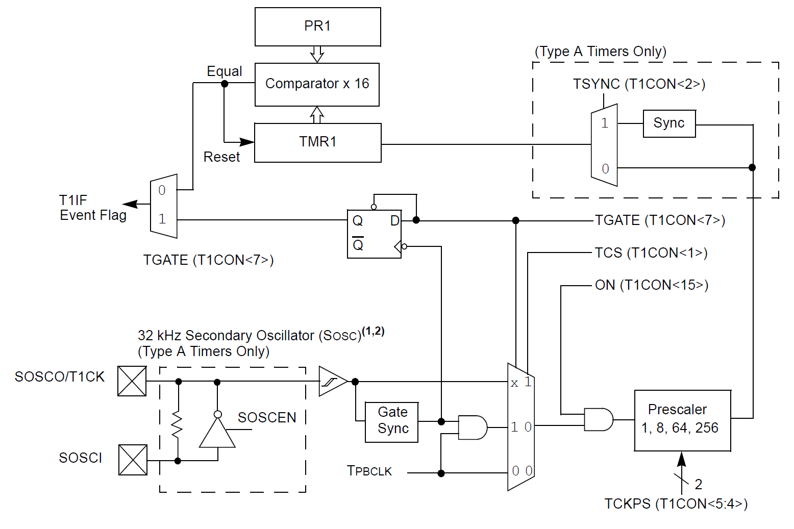

# 📑 Table of Contents

- [Table of Contents](#-table-of-contents)
- [Introduction to Timers on PIC32MX Microcontroller](#-introduction-to-timers-on-pic32mx-microcontroller)
- [Dependencies](#-dependencies)
- [Features of the Driver](#-features-of-the-driver)
- [API Documentation and Usage](#-api-documentation-and-usage)
  - [Macro Definitions](#macro-definitions)
  - [Data Types and Structures](#data-types-and-structures)
  - [Driver Functions](#driver-functions)
- [Hands-on Examples](#️-hands-on-examples)
  - [Example: Timeout Mode Operation](#example-timeout-mode-operation)

# 📘 Introduction to Timers on PIC32MX Microcontroller

The PIC32 device family has two different types of timers, depending on the particular device. Timers are useful for generating accurate time-based periodic interrupt events for software applications or real-time operating systems. Other uses include counting external pulses or accurate timing measurement of external events by using the timer’s gate feature. With certain exceptions, all of the timers have the same functional circuitry. The timers are broadly classified into two types, namely:
- Type A Timer (16-bit synchronous/asynchronous timer/counter with gate)
- Type B Timer (16-bit or 32-bit synchronous timer/counter with gate and Special Event Trigger)

<div align="center">

<a id="fig1"></a>


**Figure 1**: PIC32 Type A Timer Block Diagram.<br>
<small>Source: Microchip PIC32 Documentation</small>

</div>

Possible modes of Timer operation:
- 16/32-bit synchronous clock counter
- 16/32-bit synchronous external clock counter
- 16/32-bit gated Timer
- Asynchronous clock counter (Type A only)

# 📚 Dependencies

The Timer driver depends on the following libraries:
- `Pio.h`: provides control over the Peripheral Pin Select module, which handles Timer pin remapping, and the Programmable Inputs Outputs module, which configures them.
- `Osc.h`: provides means of reading peripheral clock frequency and determining clock source.
- `Ic.h`: provides interrupt control functions for interrupt-based Timer operations.

# ✨ Features of the Driver

The Timer driver currently supports:
- Generating a polling-based delay
- Generating an interrupt-based delay (timeout mode)
- Measuring the presence of an external signal (gated mode) with optional falling-edge triggered event

# 📖 API Documentation and Usage

This section offers a brief introduction to the Timer API. For comprehensive details, please refer to the [PIC32MX_Timer_API_doc](PIC32MX_Timer_API_doc.pdf). It's important to note that the `Tmr.c` and `Tmr.h` files are thoroughly annotated with quality comment blocks for your convenience.

## Macro Definitions

The API employs preprocessor macros to facilitate a certain level of configuration for interrupt-based operation settings. However, if your preference leans towards polling-based operations, feel free to disregard these macros. The defines `TMRx_ISR_IPL`, `TMRx_ICX_IPL`, and `TMRx_ICX_ISL` (where `x` ranges from 1 to 5) set the Timer interrupt priority and sub-priority levels. Additionally, the defines for the Core Timer `CT_ISR_IPL`, `CT_ICX_IPL`, and `CT_ICX_ISL` exits and shouldn't be changed as the Core Time should have the highest priority.

As for the polling-based operations the `TMR_DELAY_SYSCLK` macro should be set for the sole purpose of using delay functions. Default value is `8000000` which represents internal clock frequency of 8MHz. This is true by default for the PIC32MX MCU if not reconfigured by a user.

## Data Types and Structures

Note that only `struct` types are outlined here. Other, `enum` types are assumed to be self-explanatory to the reader.

### `TmrTimeoutConfig_t`

This configuration structure provides parameters for a Timer module operating in the Timeout mode.

### `TmrGatedConfig_t`

This configuration structure provides parameters for a Timer module operating in the Gated mode.

## Driver Functions

### `TMR_ConfigTimeoutModeSfr()`
```cpp
bool TMR_ConfigTimeoutModeSfr(TmrSfr_t *const tmrSfr, TmrTimeoutConfig_t tmrConfig);
```
This function configures Timer SFRs for timeout operation.

### `TMR_ConfigGatedModeSfr()`
```cpp
bool TMR_ConfigGatedModeSfr(TmrSfr_t *const tmrSfr, TmrGatedConfig_t tmrConfig);
```
This function configures Timer SFRs for gated operation.

### `TMR_SetCallback()`
```cpp
bool TMR_SetCallback(TmrSfr_t *const tmrSfr, void (*isrHandler)(void));
```
This function sets a handler to execute in an ISR when operating in timeout or gated mode.

### `TMR_SetCoreTimerCallback()`
```cpp
bool TMR_SetCoreTimerCallback(void (*isrHandler)(void));
```
This function sets a handler to execute in the Core timer ISR.

### `TMR_SetTimeoutPeriod()`
```cpp
bool TMR_SetTimeoutPeriod(TmrSfr_t *const tmrSfr, uint32_t period);
```
This function sets a timeout period for a specific Timer module.

### `TMR_StartTimer()`
```cpp
INLINE void TMR_StartTimer(TmrSfr_t *const tmrSfr);
```
This function starts a previously configured Timer module.

### `TMR_StopTimer()`
```cpp
INLINE void TMR_StopTimer(TmrSfr_t *const tmrSfr);
```
This function stops a previously started Timer module.

### `TMR_DelayUs()`
```cpp
INLINE void TMR_DelayUs(uint32_t delay);
```
This function is a polling-based delay that counts microseconds.

### `TMR_DelayMs()`
```cpp
INLINE void TMR_DelayMs(uint32_t delay);
```
This function is a polling-based delay that counts milliseconds.

### `TMR_ReadTimer()`
```cpp
INLINE uint32_t TMR_ReadTimer(TmrSfr_t *const tmrSfr);
```
This function reads Timer count register of a given Timer module base address.

### `TMR_ReadTimerPeriod()`
```cpp
INLINE double TMR_ReadTimerPeriod(TmrSfr_t *const tmrSfr);
```
This function calculates time period in seconds (timeout or gated mode).

# 🖥️ Hands-on Examples

This section showcases how to utilize the API covered in the previous section, providing practical examples. The examples are briefly summarized for demonstration purposes. For comprehensive details, please refer to the [PIC32MX_Timer_API_doc](PIC32MX_Timer_API_doc.pdf) documentation. The complete code of the examples outlined below can be found in the [examples](examples) folder.

## Example: Timeout Mode Operation

Below is an example demonstrating how to configure a Timer module to operate in the Timeout mode. In this mode a Timer module counts until the desired count is reached, executes user-defined callback thru internal ISR handler, and restarts count. Whereas in the Gated mode Timer's count register is updated each time an external signal changes. Please see the Gated mode example [here](./examples/gated-mode.c).

```cpp
/** Custom libs **/
#include "Tmr.h"

/** Test prototype **/
static void TestFunct(void);

int main(int argc, char** argv)
{
	/* Configuration structure for timeout mode */
	TmrTimeoutConfig_t tmrTimeoutConfig = {
		.bitMode = TMR_BITMODE_32BIT,
		.clkDiv = TMR_CLK_DIV_1,
		.clkSrc = TMR_CLK_SRC_PBCLK,
		.timeUnit = TMR_TIME_UNIT_US
	};

	/* Configure indication pin */
	PIO_ConfigGpioPin(GPIO_RPB2, PIO_TYPE_DIGITAL, PIO_DIR_OUTPUT);

	/* Configure TMR module for timeout mode */
	TMR_ConfigSfrTimeoutMode(&TMR2_MODULE, tmrTimeoutConfig);

	/* Configure a function pointer */
	TMR_SetCallback(&TMR2_MODULE, TestFunct);

	/* Set a timeout period */
	TMR_SetTimerPeriod(&TMR2_MODULE, 100000);

	/* Set pin (clear it after timeout) */
	PIO_ClearPin(GPIO_RPB2);
	PIO_SetPin(GPIO_RPB2);

	/* Start a timeout */
	TMR_StartTimer(&TMR2_MODULE);

	while (1)
	{
		/* Main program execution */
		/* Stop timeout if this is reached before "TestFunct()" */
		TMR_StopTimer(&TMR2_MODULE);
		PIO_ClearPin(GPIO_RPB2);
	}

	return 0;
}

/** Test function **/
static void TestFunct(void)
{
	PIO_TogglePin(GPIO_RPB2);
}
```

# 

&copy; Luka Gacnik, 2023
